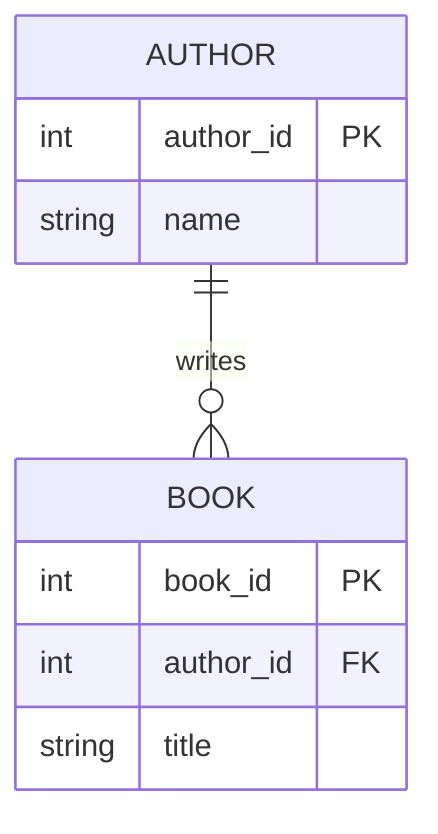

```mermaid
erDiagram
    AUTHOR {
        int author_id PK
        string name
    }
    BOOK {
        int book_id PK
        int author_id FK
        string title
    }
    AUTHOR ||--o{ BOOK : writes
```
